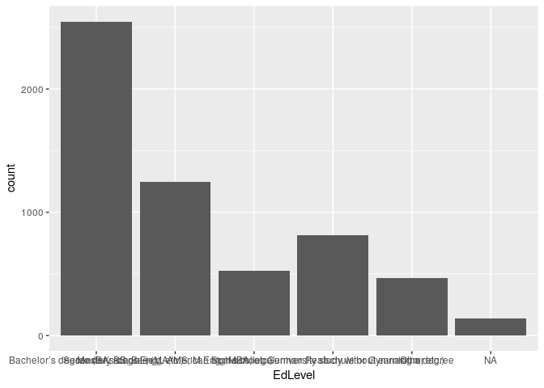
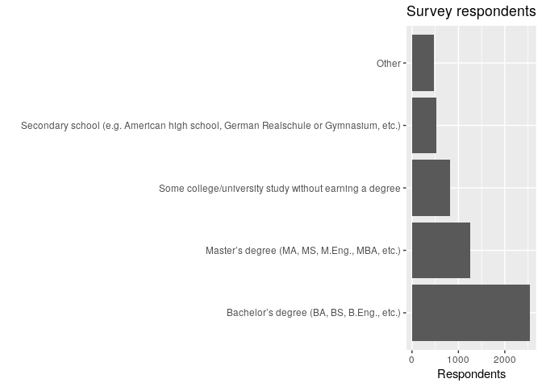

Intro to R
================
Mike Spencer
2nd July 2019

## Intro

This is an R Markdown document. Markdown is a simple formatting syntax
for authoring HTML, PDF, and MS Word documents. For more details on
using R Markdown see <http://rmarkdown.rstudio.com>.

We’re using <https://rstudio.cloud/> to host the workshop. The
conditions of use mean we can only use this for educational purposes.
It’s a great resource for teaching, but is underpowered for most
analysis. The big advantage is you can access RStudio through a web
browser without the need to install anything\!

The dataset you’ll be working with today is the developer survey from
Stackoverflow. You can download it from
<https://insights.stackoverflow.com/survey>.

## Help\!

… and further resources

  - `?Function`
  - <https://www.tidyverse.org/>
  - <http://swcarpentry.github.io/r-novice-inflammation>
  - <https://datacarpentry.org/R-ecology-lesson/> or
    <https://datacarpentry.org/r-socialsci/>
  - <https://www.rstudio.com/resources/cheatsheets/>
  - <https://www.coursera.org/learn/r-programming?>
  - <https://r4ds.had.co.nz/>
  - <http://dx.doi.org/10.18637/jss.v059.i10> 131256 downloads\!
  - <https://bitbucket.org/sruclees/help/wiki/Home> SRUC REES data wiki

## Language tips

  - functions end in ()
  - `?` before a function name for help
  - objects are plain text
  - %\>% sends output to next function
  - Wrap strings in "" or ’’
  - Separate arguments in function with a `,`
  - Use formatting to make code easier to read

## Packages

``` r
library(tidyverse)
```

    ## Registered S3 methods overwritten by 'ggplot2':
    ##   method         from 
    ##   [.quosures     rlang
    ##   c.quosures     rlang
    ##   print.quosures rlang

    ## ── Attaching packages ─────────────────────────────────────────────────────────────────────────────────────── tidyverse 1.2.1 ──

    ## ✔ ggplot2 3.1.1     ✔ purrr   0.3.2
    ## ✔ tibble  2.1.1     ✔ dplyr   0.8.1
    ## ✔ tidyr   0.8.3     ✔ stringr 1.4.0
    ## ✔ readr   1.3.1     ✔ forcats 0.4.0

    ## ── Conflicts ────────────────────────────────────────────────────────────────────────────────────────── tidyverse_conflicts() ──
    ## ✖ dplyr::filter() masks stats::filter()
    ## ✖ dplyr::lag()    masks stats::lag()

## Data

### Read

``` r
df = read_csv("../data/survey_results_public.csv")
```

    ## Parsed with column specification:
    ## cols(
    ##   .default = col_character(),
    ##   Respondent = col_double(),
    ##   CompTotal = col_double(),
    ##   ConvertedComp = col_double(),
    ##   WorkWeekHrs = col_double(),
    ##   CodeRevHrs = col_double(),
    ##   Age = col_double()
    ## )

    ## See spec(...) for full column specifications.

``` r
schema = read_csv("../data/survey_results_schema.csv")
```

    ## Parsed with column specification:
    ## cols(
    ##   Column = col_character(),
    ##   QuestionText = col_character()
    ## )

``` r
?read_csv
```

### Explore

  - See the `Environment` pane.
  - What did R return after each dataset was read?

<!-- end list -->

``` r
schema
```

    ## # A tibble: 85 x 2
    ##    Column        QuestionText                                              
    ##    <chr>         <chr>                                                     
    ##  1 Respondent    Randomized respondent ID number (not in order of survey r…
    ##  2 MainBranch    "Which of the following options best describes you today?…
    ##  3 Hobbyist      Do you code as a hobby?                                   
    ##  4 OpenSourcer   How often do you contribute to open source?               
    ##  5 OpenSource    How do you feel about the quality of open source software…
    ##  6 Employment    Which of the following best describes your current employ…
    ##  7 Country       In which country do you currently reside?                 
    ##  8 Student       Are you currently enrolled in a formal, degree-granting c…
    ##  9 EdLevel       Which of the following best describes the highest level o…
    ## 10 UndergradMaj… What was your main or most important field of study?      
    ## # … with 75 more rows

``` r
glimpse(df)
```

    ## Observations: 88,883
    ## Variables: 85
    ## $ Respondent             <dbl> 1, 2, 3, 4, 5, 6, 7, 8, 9, 10, 11, 12, 13…
    ## $ MainBranch             <chr> "I am a student who is learning to code",…
    ## $ Hobbyist               <chr> "Yes", "No", "Yes", "No", "Yes", "Yes", "…
    ## $ OpenSourcer            <chr> "Never", "Less than once per year", "Neve…
    ## $ OpenSource             <chr> "The quality of OSS and closed source sof…
    ## $ Employment             <chr> "Not employed, and not looking for work",…
    ## $ Country                <chr> "United Kingdom", "Bosnia and Herzegovina…
    ## $ Student                <chr> "No", "Yes, full-time", "No", "No", "No",…
    ## $ EdLevel                <chr> "Primary/elementary school", "Secondary s…
    ## $ UndergradMajor         <chr> NA, NA, "Web development or web design", …
    ## $ EduOther               <chr> "Taught yourself a new language, framewor…
    ## $ OrgSize                <chr> NA, NA, "100 to 499 employees", "100 to 4…
    ## $ DevType                <chr> NA, "Developer, desktop or enterprise app…
    ## $ YearsCode              <chr> "4", NA, "3", "3", "16", "13", "6", "8", …
    ## $ Age1stCode             <chr> "10", "17", "22", "16", "14", "15", "17",…
    ## $ YearsCodePro           <chr> NA, NA, "1", "Less than 1 year", "9", "3"…
    ## $ CareerSat              <chr> NA, NA, "Slightly satisfied", "Very satis…
    ## $ JobSat                 <chr> NA, NA, "Slightly satisfied", "Slightly s…
    ## $ MgrIdiot               <chr> NA, NA, "Not at all confident", "Very con…
    ## $ MgrMoney               <chr> NA, NA, "Not sure", "No", "Yes", "No", NA…
    ## $ MgrWant                <chr> NA, NA, "Not sure", "Not sure", "No", "Ye…
    ## $ JobSeek                <chr> NA, "I am actively looking for a job", "I…
    ## $ LastHireDate           <chr> NA, "I've never had a job", "1-2 years ag…
    ## $ LastInt                <chr> NA, NA, "Interview with people in peer ro…
    ## $ FizzBuzz               <chr> NA, NA, "No", "No", "No", "No", "No", NA,…
    ## $ JobFactors             <chr> NA, "Financial performance or funding sta…
    ## $ ResumeUpdate           <chr> NA, "Something else changed (education, a…
    ## $ CurrencySymbol         <chr> NA, NA, "THB", "USD", "UAH", "CAD", "USD"…
    ## $ CurrencyDesc           <chr> NA, NA, "Thai baht", "United States dolla…
    ## $ CompTotal              <dbl> NA, NA, 23000, 61000, NA, 40000, NA, NA, …
    ## $ CompFreq               <chr> NA, NA, "Monthly", "Yearly", NA, "Monthly…
    ## $ ConvertedComp          <dbl> NA, NA, 8820, 61000, NA, 366420, NA, NA, …
    ## $ WorkWeekHrs            <dbl> NA, NA, 40, 80, 55, 15, 32, NA, 32, 70, N…
    ## $ WorkPlan               <chr> NA, NA, "There's no schedule or spec; I w…
    ## $ WorkChallenge          <chr> NA, NA, "Distracting work environment;Ina…
    ## $ WorkRemote             <chr> NA, NA, "Less than once per month / Never…
    ## $ WorkLoc                <chr> NA, NA, "Home", "Home", "Office", "Home",…
    ## $ ImpSyn                 <chr> NA, NA, "Average", "A little below averag…
    ## $ CodeRev                <chr> NA, NA, "No", "No", "Yes, because I see v…
    ## $ CodeRevHrs             <dbl> NA, NA, NA, NA, NA, NA, 6.0, NA, 12.0, 4.…
    ## $ UnitTests              <chr> NA, NA, "No, but I think we should", "No,…
    ## $ PurchaseHow            <chr> NA, NA, "Not sure", "Developers typically…
    ## $ PurchaseWhat           <chr> NA, NA, "I have little or no influence", …
    ## $ LanguageWorkedWith     <chr> "HTML/CSS;Java;JavaScript;Python", "C++;H…
    ## $ LanguageDesireNextYear <chr> "C;C++;C#;Go;HTML/CSS;Java;JavaScript;Pyt…
    ## $ DatabaseWorkedWith     <chr> "SQLite", NA, "PostgreSQL", "MySQL;SQLite…
    ## $ DatabaseDesireNextYear <chr> "MySQL", "MySQL", "PostgreSQL", "MySQL;SQ…
    ## $ PlatformWorkedWith     <chr> "MacOS;Windows", "Windows", NA, "Linux;Wi…
    ## $ PlatformDesireNextYear <chr> "Android;Arduino;Windows", "Windows", NA,…
    ## $ WebFrameWorkedWith     <chr> "Django;Flask", "Django", NA, NA, "Django…
    ## $ WebFrameDesireNextYear <chr> "Flask;jQuery", "Django", "Other(s):", NA…
    ## $ MiscTechWorkedWith     <chr> "Node.js", NA, NA, ".NET", "Cordova;Node.…
    ## $ MiscTechDesireNextYear <chr> "Node.js", NA, NA, ".NET", "Apache Spark;…
    ## $ DevEnviron             <chr> "IntelliJ;Notepad++;PyCharm", "Atom;PyCha…
    ## $ OpSys                  <chr> "Windows", "Windows", "Linux-based", "Win…
    ## $ Containers             <chr> "I do not use containers", "I do not use …
    ## $ BlockchainOrg          <chr> NA, NA, NA, "Not at all", "Not at all", "…
    ## $ BlockchainIs           <chr> NA, "Useful across many domains and could…
    ## $ BetterLife             <chr> "Yes", "Yes", "Yes", "Yes", "Yes", "No", …
    ## $ ITperson               <chr> "Fortunately, someone else has that title…
    ## $ OffOn                  <chr> "Yes", "Yes", "Yes", "Yes", "Yes", "No", …
    ## $ SocialMedia            <chr> "Twitter", "Instagram", "Reddit", "Reddit…
    ## $ Extraversion           <chr> "Online", "Online", "In real life (in per…
    ## $ ScreenName             <chr> "Username", "Username", "Username", "User…
    ## $ SOVisit1st             <chr> "2017", "2017", "2011", "2014", "I don't …
    ## $ SOVisitFreq            <chr> "A few times per month or weekly", "Daily…
    ## $ SOVisitTo              <chr> "Find answers to specific questions;Learn…
    ## $ SOFindAnswer           <chr> "3-5 times per week", "3-5 times per week…
    ## $ SOTimeSaved            <chr> "Stack Overflow was much faster", "Stack …
    ## $ SOHowMuchTime          <chr> "31-60 minutes", "11-30 minutes", NA, "31…
    ## $ SOAccount              <chr> "No", "Yes", "Yes", "Yes", "Yes", "Yes", …
    ## $ SOPartFreq             <chr> NA, "A few times per month or weekly", "L…
    ## $ SOJobs                 <chr> "No, I didn't know that Stack Overflow ha…
    ## $ EntTeams               <chr> "No, and I don't know what those are", "N…
    ## $ SOComm                 <chr> "Neutral", "Yes, somewhat", "Neutral", "N…
    ## $ WelcomeChange          <chr> "Just as welcome now as I felt last year"…
    ## $ SONewContent           <chr> "Tech articles written by other developer…
    ## $ Age                    <dbl> 14, 19, 28, 22, 30, 28, 42, 24, 23, NA, 2…
    ## $ Gender                 <chr> "Man", "Man", "Man", "Man", "Man", "Man",…
    ## $ Trans                  <chr> "No", "No", "No", "No", "No", "No", "No",…
    ## $ Sexuality              <chr> "Straight / Heterosexual", "Straight / He…
    ## $ Ethnicity              <chr> NA, NA, NA, "White or of European descent…
    ## $ Dependents             <chr> "No", "No", "Yes", "No", "No", "No", "Yes…
    ## $ SurveyLength           <chr> "Appropriate in length", "Appropriate in …
    ## $ SurveyEase             <chr> "Neither easy nor difficult", "Neither ea…

``` r
summary(df)
```

    ##    Respondent     MainBranch          Hobbyist         OpenSourcer       
    ##  Min.   :    1   Length:88883       Length:88883       Length:88883      
    ##  1st Qu.:22222   Class :character   Class :character   Class :character  
    ##  Median :44442   Mode  :character   Mode  :character   Mode  :character  
    ##  Mean   :44442                                                           
    ##  3rd Qu.:66662                                                           
    ##  Max.   :88883                                                           
    ##                                                                          
    ##   OpenSource         Employment          Country         
    ##  Length:88883       Length:88883       Length:88883      
    ##  Class :character   Class :character   Class :character  
    ##  Mode  :character   Mode  :character   Mode  :character  
    ##                                                          
    ##                                                          
    ##                                                          
    ##                                                          
    ##    Student            EdLevel          UndergradMajor    
    ##  Length:88883       Length:88883       Length:88883      
    ##  Class :character   Class :character   Class :character  
    ##  Mode  :character   Mode  :character   Mode  :character  
    ##                                                          
    ##                                                          
    ##                                                          
    ##                                                          
    ##    EduOther           OrgSize            DevType         
    ##  Length:88883       Length:88883       Length:88883      
    ##  Class :character   Class :character   Class :character  
    ##  Mode  :character   Mode  :character   Mode  :character  
    ##                                                          
    ##                                                          
    ##                                                          
    ##                                                          
    ##   YearsCode          Age1stCode        YearsCodePro      
    ##  Length:88883       Length:88883       Length:88883      
    ##  Class :character   Class :character   Class :character  
    ##  Mode  :character   Mode  :character   Mode  :character  
    ##                                                          
    ##                                                          
    ##                                                          
    ##                                                          
    ##   CareerSat            JobSat            MgrIdiot        
    ##  Length:88883       Length:88883       Length:88883      
    ##  Class :character   Class :character   Class :character  
    ##  Mode  :character   Mode  :character   Mode  :character  
    ##                                                          
    ##                                                          
    ##                                                          
    ##                                                          
    ##    MgrMoney           MgrWant            JobSeek         
    ##  Length:88883       Length:88883       Length:88883      
    ##  Class :character   Class :character   Class :character  
    ##  Mode  :character   Mode  :character   Mode  :character  
    ##                                                          
    ##                                                          
    ##                                                          
    ##                                                          
    ##  LastHireDate         LastInt            FizzBuzz        
    ##  Length:88883       Length:88883       Length:88883      
    ##  Class :character   Class :character   Class :character  
    ##  Mode  :character   Mode  :character   Mode  :character  
    ##                                                          
    ##                                                          
    ##                                                          
    ##                                                          
    ##   JobFactors        ResumeUpdate       CurrencySymbol    
    ##  Length:88883       Length:88883       Length:88883      
    ##  Class :character   Class :character   Class :character  
    ##  Mode  :character   Mode  :character   Mode  :character  
    ##                                                          
    ##                                                          
    ##                                                          
    ##                                                          
    ##  CurrencyDesc         CompTotal           CompFreq        
    ##  Length:88883       Min.   :0.000e+00   Length:88883      
    ##  Class :character   1st Qu.:2.000e+04   Class :character  
    ##  Mode  :character   Median :6.200e+04   Mode  :character  
    ##                     Mean   :5.519e+11                     
    ##                     3rd Qu.:1.200e+05                     
    ##                     Max.   :1.000e+16                     
    ##                     NA's   :32938                         
    ##  ConvertedComp      WorkWeekHrs        WorkPlan         WorkChallenge     
    ##  Min.   :      0   Min.   :   1.00   Length:88883       Length:88883      
    ##  1st Qu.:  25778   1st Qu.:  40.00   Class :character   Class :character  
    ##  Median :  57287   Median :  40.00   Mode  :character   Mode  :character  
    ##  Mean   : 127111   Mean   :  42.13                                        
    ##  3rd Qu.: 100000   3rd Qu.:  44.75                                        
    ##  Max.   :2000000   Max.   :4850.00                                        
    ##  NA's   :33060     NA's   :24380                                          
    ##   WorkRemote          WorkLoc             ImpSyn         
    ##  Length:88883       Length:88883       Length:88883      
    ##  Class :character   Class :character   Class :character  
    ##  Mode  :character   Mode  :character   Mode  :character  
    ##                                                          
    ##                                                          
    ##                                                          
    ##                                                          
    ##    CodeRev            CodeRevHrs     UnitTests         PurchaseHow       
    ##  Length:88883       Min.   : 0.00   Length:88883       Length:88883      
    ##  Class :character   1st Qu.: 2.00   Class :character   Class :character  
    ##  Mode  :character   Median : 4.00   Mode  :character   Mode  :character  
    ##                     Mean   : 5.08                                        
    ##                     3rd Qu.: 6.00                                        
    ##                     Max.   :99.00                                        
    ##                     NA's   :39093                                        
    ##  PurchaseWhat       LanguageWorkedWith LanguageDesireNextYear
    ##  Length:88883       Length:88883       Length:88883          
    ##  Class :character   Class :character   Class :character      
    ##  Mode  :character   Mode  :character   Mode  :character      
    ##                                                              
    ##                                                              
    ##                                                              
    ##                                                              
    ##  DatabaseWorkedWith DatabaseDesireNextYear PlatformWorkedWith
    ##  Length:88883       Length:88883           Length:88883      
    ##  Class :character   Class :character       Class :character  
    ##  Mode  :character   Mode  :character       Mode  :character  
    ##                                                              
    ##                                                              
    ##                                                              
    ##                                                              
    ##  PlatformDesireNextYear WebFrameWorkedWith WebFrameDesireNextYear
    ##  Length:88883           Length:88883       Length:88883          
    ##  Class :character       Class :character   Class :character      
    ##  Mode  :character       Mode  :character   Mode  :character      
    ##                                                                  
    ##                                                                  
    ##                                                                  
    ##                                                                  
    ##  MiscTechWorkedWith MiscTechDesireNextYear  DevEnviron       
    ##  Length:88883       Length:88883           Length:88883      
    ##  Class :character   Class :character       Class :character  
    ##  Mode  :character   Mode  :character       Mode  :character  
    ##                                                              
    ##                                                              
    ##                                                              
    ##                                                              
    ##     OpSys            Containers        BlockchainOrg     
    ##  Length:88883       Length:88883       Length:88883      
    ##  Class :character   Class :character   Class :character  
    ##  Mode  :character   Mode  :character   Mode  :character  
    ##                                                          
    ##                                                          
    ##                                                          
    ##                                                          
    ##  BlockchainIs        BetterLife          ITperson        
    ##  Length:88883       Length:88883       Length:88883      
    ##  Class :character   Class :character   Class :character  
    ##  Mode  :character   Mode  :character   Mode  :character  
    ##                                                          
    ##                                                          
    ##                                                          
    ##                                                          
    ##     OffOn           SocialMedia        Extraversion      
    ##  Length:88883       Length:88883       Length:88883      
    ##  Class :character   Class :character   Class :character  
    ##  Mode  :character   Mode  :character   Mode  :character  
    ##                                                          
    ##                                                          
    ##                                                          
    ##                                                          
    ##   ScreenName         SOVisit1st        SOVisitFreq       
    ##  Length:88883       Length:88883       Length:88883      
    ##  Class :character   Class :character   Class :character  
    ##  Mode  :character   Mode  :character   Mode  :character  
    ##                                                          
    ##                                                          
    ##                                                          
    ##                                                          
    ##   SOVisitTo         SOFindAnswer       SOTimeSaved       
    ##  Length:88883       Length:88883       Length:88883      
    ##  Class :character   Class :character   Class :character  
    ##  Mode  :character   Mode  :character   Mode  :character  
    ##                                                          
    ##                                                          
    ##                                                          
    ##                                                          
    ##  SOHowMuchTime       SOAccount          SOPartFreq       
    ##  Length:88883       Length:88883       Length:88883      
    ##  Class :character   Class :character   Class :character  
    ##  Mode  :character   Mode  :character   Mode  :character  
    ##                                                          
    ##                                                          
    ##                                                          
    ##                                                          
    ##     SOJobs            EntTeams            SOComm         
    ##  Length:88883       Length:88883       Length:88883      
    ##  Class :character   Class :character   Class :character  
    ##  Mode  :character   Mode  :character   Mode  :character  
    ##                                                          
    ##                                                          
    ##                                                          
    ##                                                          
    ##  WelcomeChange      SONewContent            Age           Gender         
    ##  Length:88883       Length:88883       Min.   : 1.00   Length:88883      
    ##  Class :character   Class :character   1st Qu.:24.00   Class :character  
    ##  Mode  :character   Mode  :character   Median :29.00   Mode  :character  
    ##                                        Mean   :30.34                     
    ##                                        3rd Qu.:35.00                     
    ##                                        Max.   :99.00                     
    ##                                        NA's   :9673                      
    ##     Trans            Sexuality          Ethnicity        
    ##  Length:88883       Length:88883       Length:88883      
    ##  Class :character   Class :character   Class :character  
    ##  Mode  :character   Mode  :character   Mode  :character  
    ##                                                          
    ##                                                          
    ##                                                          
    ##                                                          
    ##   Dependents        SurveyLength        SurveyEase       
    ##  Length:88883       Length:88883       Length:88883      
    ##  Class :character   Class :character   Class :character  
    ##  Mode  :character   Mode  :character   Mode  :character  
    ##                                                          
    ##                                                          
    ##                                                          
    ## 

``` r
View(df)
colnames(df)
```

    ##  [1] "Respondent"             "MainBranch"            
    ##  [3] "Hobbyist"               "OpenSourcer"           
    ##  [5] "OpenSource"             "Employment"            
    ##  [7] "Country"                "Student"               
    ##  [9] "EdLevel"                "UndergradMajor"        
    ## [11] "EduOther"               "OrgSize"               
    ## [13] "DevType"                "YearsCode"             
    ## [15] "Age1stCode"             "YearsCodePro"          
    ## [17] "CareerSat"              "JobSat"                
    ## [19] "MgrIdiot"               "MgrMoney"              
    ## [21] "MgrWant"                "JobSeek"               
    ## [23] "LastHireDate"           "LastInt"               
    ## [25] "FizzBuzz"               "JobFactors"            
    ## [27] "ResumeUpdate"           "CurrencySymbol"        
    ## [29] "CurrencyDesc"           "CompTotal"             
    ## [31] "CompFreq"               "ConvertedComp"         
    ## [33] "WorkWeekHrs"            "WorkPlan"              
    ## [35] "WorkChallenge"          "WorkRemote"            
    ## [37] "WorkLoc"                "ImpSyn"                
    ## [39] "CodeRev"                "CodeRevHrs"            
    ## [41] "UnitTests"              "PurchaseHow"           
    ## [43] "PurchaseWhat"           "LanguageWorkedWith"    
    ## [45] "LanguageDesireNextYear" "DatabaseWorkedWith"    
    ## [47] "DatabaseDesireNextYear" "PlatformWorkedWith"    
    ## [49] "PlatformDesireNextYear" "WebFrameWorkedWith"    
    ## [51] "WebFrameDesireNextYear" "MiscTechWorkedWith"    
    ## [53] "MiscTechDesireNextYear" "DevEnviron"            
    ## [55] "OpSys"                  "Containers"            
    ## [57] "BlockchainOrg"          "BlockchainIs"          
    ## [59] "BetterLife"             "ITperson"              
    ## [61] "OffOn"                  "SocialMedia"           
    ## [63] "Extraversion"           "ScreenName"            
    ## [65] "SOVisit1st"             "SOVisitFreq"           
    ## [67] "SOVisitTo"              "SOFindAnswer"          
    ## [69] "SOTimeSaved"            "SOHowMuchTime"         
    ## [71] "SOAccount"              "SOPartFreq"            
    ## [73] "SOJobs"                 "EntTeams"              
    ## [75] "SOComm"                 "WelcomeChange"         
    ## [77] "SONewContent"           "Age"                   
    ## [79] "Gender"                 "Trans"                 
    ## [81] "Sexuality"              "Ethnicity"             
    ## [83] "Dependents"             "SurveyLength"          
    ## [85] "SurveyEase"

## Building blocks

### Select columns

``` r
df %>% 
   select(Employment, Country)
```

    ## # A tibble: 88,883 x 2
    ##    Employment                                         Country              
    ##    <chr>                                              <chr>                
    ##  1 Not employed, and not looking for work             United Kingdom       
    ##  2 Not employed, but looking for work                 Bosnia and Herzegovi…
    ##  3 Employed full-time                                 Thailand             
    ##  4 Employed full-time                                 United States        
    ##  5 Employed full-time                                 Ukraine              
    ##  6 Employed full-time                                 Canada               
    ##  7 Independent contractor, freelancer, or self-emplo… Ukraine              
    ##  8 Not employed, but looking for work                 India                
    ##  9 Employed full-time                                 New Zealand          
    ## 10 Employed full-time                                 India                
    ## # … with 88,873 more rows

``` r
df %>% 
   select(-Respondent)
```

    ## # A tibble: 88,883 x 84
    ##    MainBranch Hobbyist OpenSourcer OpenSource Employment Country Student
    ##    <chr>      <chr>    <chr>       <chr>      <chr>      <chr>   <chr>  
    ##  1 I am a st… Yes      Never       The quali… Not emplo… United… No     
    ##  2 I am a st… No       Less than … The quali… Not emplo… Bosnia… Yes, f…
    ##  3 I am not … Yes      Never       The quali… Employed … Thaila… No     
    ##  4 I am a de… No       Never       The quali… Employed … United… No     
    ##  5 I am a de… Yes      Once a mon… OSS is, o… Employed … Ukraine No     
    ##  6 I am not … Yes      Never       The quali… Employed … Canada  No     
    ##  7 I am a de… No       Never       The quali… Independe… Ukraine No     
    ##  8 I code pr… Yes      Less than … OSS is, o… Not emplo… India   <NA>   
    ##  9 I am a de… Yes      Once a mon… The quali… Employed … New Ze… No     
    ## 10 I am a de… Yes      Once a mon… OSS is, o… Employed … India   No     
    ## # … with 88,873 more rows, and 77 more variables: EdLevel <chr>,
    ## #   UndergradMajor <chr>, EduOther <chr>, OrgSize <chr>, DevType <chr>,
    ## #   YearsCode <chr>, Age1stCode <chr>, YearsCodePro <chr>,
    ## #   CareerSat <chr>, JobSat <chr>, MgrIdiot <chr>, MgrMoney <chr>,
    ## #   MgrWant <chr>, JobSeek <chr>, LastHireDate <chr>, LastInt <chr>,
    ## #   FizzBuzz <chr>, JobFactors <chr>, ResumeUpdate <chr>,
    ## #   CurrencySymbol <chr>, CurrencyDesc <chr>, CompTotal <dbl>,
    ## #   CompFreq <chr>, ConvertedComp <dbl>, WorkWeekHrs <dbl>,
    ## #   WorkPlan <chr>, WorkChallenge <chr>, WorkRemote <chr>, WorkLoc <chr>,
    ## #   ImpSyn <chr>, CodeRev <chr>, CodeRevHrs <dbl>, UnitTests <chr>,
    ## #   PurchaseHow <chr>, PurchaseWhat <chr>, LanguageWorkedWith <chr>,
    ## #   LanguageDesireNextYear <chr>, DatabaseWorkedWith <chr>,
    ## #   DatabaseDesireNextYear <chr>, PlatformWorkedWith <chr>,
    ## #   PlatformDesireNextYear <chr>, WebFrameWorkedWith <chr>,
    ## #   WebFrameDesireNextYear <chr>, MiscTechWorkedWith <chr>,
    ## #   MiscTechDesireNextYear <chr>, DevEnviron <chr>, OpSys <chr>,
    ## #   Containers <chr>, BlockchainOrg <chr>, BlockchainIs <chr>,
    ## #   BetterLife <chr>, ITperson <chr>, OffOn <chr>, SocialMedia <chr>,
    ## #   Extraversion <chr>, ScreenName <chr>, SOVisit1st <chr>,
    ## #   SOVisitFreq <chr>, SOVisitTo <chr>, SOFindAnswer <chr>,
    ## #   SOTimeSaved <chr>, SOHowMuchTime <chr>, SOAccount <chr>,
    ## #   SOPartFreq <chr>, SOJobs <chr>, EntTeams <chr>, SOComm <chr>,
    ## #   WelcomeChange <chr>, SONewContent <chr>, Age <dbl>, Gender <chr>,
    ## #   Trans <chr>, Sexuality <chr>, Ethnicity <chr>, Dependents <chr>,
    ## #   SurveyLength <chr>, SurveyEase <chr>

### Filter rows

``` r
df %>% 
   filter(Employment == "Not employed, but looking for work")
```

    ## # A tibble: 5,600 x 85
    ##    Respondent MainBranch Hobbyist OpenSourcer OpenSource Employment Country
    ##         <dbl> <chr>      <chr>    <chr>       <chr>      <chr>      <chr>  
    ##  1          2 I am a st… No       Less than … The quali… Not emplo… Bosnia…
    ##  2          8 I code pr… Yes      Less than … OSS is, o… Not emplo… India  
    ##  3         15 I am a st… Yes      Never       OSS is, o… Not emplo… India  
    ##  4         27 I used to… Yes      Less than … OSS is, o… Not emplo… Colomb…
    ##  5         34 I am a st… Yes      Never       OSS is, o… Not emplo… Sri La…
    ##  6        103 I code pr… Yes      Less than … The quali… Not emplo… Russia…
    ##  7        133 I code pr… Yes      Once a mon… The quali… Not emplo… United…
    ##  8        171 I am a st… Yes      Less than … OSS is, o… Not emplo… Bangla…
    ##  9        175 I am a st… Yes      Less than … OSS is, o… Not emplo… Greece 
    ## 10        180 I used to… Yes      Never       OSS is, o… Not emplo… Italy  
    ## # … with 5,590 more rows, and 78 more variables: Student <chr>,
    ## #   EdLevel <chr>, UndergradMajor <chr>, EduOther <chr>, OrgSize <chr>,
    ## #   DevType <chr>, YearsCode <chr>, Age1stCode <chr>, YearsCodePro <chr>,
    ## #   CareerSat <chr>, JobSat <chr>, MgrIdiot <chr>, MgrMoney <chr>,
    ## #   MgrWant <chr>, JobSeek <chr>, LastHireDate <chr>, LastInt <chr>,
    ## #   FizzBuzz <chr>, JobFactors <chr>, ResumeUpdate <chr>,
    ## #   CurrencySymbol <chr>, CurrencyDesc <chr>, CompTotal <dbl>,
    ## #   CompFreq <chr>, ConvertedComp <dbl>, WorkWeekHrs <dbl>,
    ## #   WorkPlan <chr>, WorkChallenge <chr>, WorkRemote <chr>, WorkLoc <chr>,
    ## #   ImpSyn <chr>, CodeRev <chr>, CodeRevHrs <dbl>, UnitTests <chr>,
    ## #   PurchaseHow <chr>, PurchaseWhat <chr>, LanguageWorkedWith <chr>,
    ## #   LanguageDesireNextYear <chr>, DatabaseWorkedWith <chr>,
    ## #   DatabaseDesireNextYear <chr>, PlatformWorkedWith <chr>,
    ## #   PlatformDesireNextYear <chr>, WebFrameWorkedWith <chr>,
    ## #   WebFrameDesireNextYear <chr>, MiscTechWorkedWith <chr>,
    ## #   MiscTechDesireNextYear <chr>, DevEnviron <chr>, OpSys <chr>,
    ## #   Containers <chr>, BlockchainOrg <chr>, BlockchainIs <chr>,
    ## #   BetterLife <chr>, ITperson <chr>, OffOn <chr>, SocialMedia <chr>,
    ## #   Extraversion <chr>, ScreenName <chr>, SOVisit1st <chr>,
    ## #   SOVisitFreq <chr>, SOVisitTo <chr>, SOFindAnswer <chr>,
    ## #   SOTimeSaved <chr>, SOHowMuchTime <chr>, SOAccount <chr>,
    ## #   SOPartFreq <chr>, SOJobs <chr>, EntTeams <chr>, SOComm <chr>,
    ## #   WelcomeChange <chr>, SONewContent <chr>, Age <dbl>, Gender <chr>,
    ## #   Trans <chr>, Sexuality <chr>, Ethnicity <chr>, Dependents <chr>,
    ## #   SurveyLength <chr>, SurveyEase <chr>

``` r
df %>% 
   filter(Employment != "Not employed, but looking for work")
```

    ## # A tibble: 81,581 x 85
    ##    Respondent MainBranch Hobbyist OpenSourcer OpenSource Employment Country
    ##         <dbl> <chr>      <chr>    <chr>       <chr>      <chr>      <chr>  
    ##  1          1 I am a st… Yes      Never       The quali… Not emplo… United…
    ##  2          3 I am not … Yes      Never       The quali… Employed … Thaila…
    ##  3          4 I am a de… No       Never       The quali… Employed … United…
    ##  4          5 I am a de… Yes      Once a mon… OSS is, o… Employed … Ukraine
    ##  5          6 I am not … Yes      Never       The quali… Employed … Canada 
    ##  6          7 I am a de… No       Never       The quali… Independe… Ukraine
    ##  7          9 I am a de… Yes      Once a mon… The quali… Employed … New Ze…
    ##  8         10 I am a de… Yes      Once a mon… OSS is, o… Employed … India  
    ##  9         12 I am a st… No       Never       OSS is, o… Employed … Canada 
    ## 10         13 I am a de… Yes      Less than … OSS is, o… Employed … United…
    ## # … with 81,571 more rows, and 78 more variables: Student <chr>,
    ## #   EdLevel <chr>, UndergradMajor <chr>, EduOther <chr>, OrgSize <chr>,
    ## #   DevType <chr>, YearsCode <chr>, Age1stCode <chr>, YearsCodePro <chr>,
    ## #   CareerSat <chr>, JobSat <chr>, MgrIdiot <chr>, MgrMoney <chr>,
    ## #   MgrWant <chr>, JobSeek <chr>, LastHireDate <chr>, LastInt <chr>,
    ## #   FizzBuzz <chr>, JobFactors <chr>, ResumeUpdate <chr>,
    ## #   CurrencySymbol <chr>, CurrencyDesc <chr>, CompTotal <dbl>,
    ## #   CompFreq <chr>, ConvertedComp <dbl>, WorkWeekHrs <dbl>,
    ## #   WorkPlan <chr>, WorkChallenge <chr>, WorkRemote <chr>, WorkLoc <chr>,
    ## #   ImpSyn <chr>, CodeRev <chr>, CodeRevHrs <dbl>, UnitTests <chr>,
    ## #   PurchaseHow <chr>, PurchaseWhat <chr>, LanguageWorkedWith <chr>,
    ## #   LanguageDesireNextYear <chr>, DatabaseWorkedWith <chr>,
    ## #   DatabaseDesireNextYear <chr>, PlatformWorkedWith <chr>,
    ## #   PlatformDesireNextYear <chr>, WebFrameWorkedWith <chr>,
    ## #   WebFrameDesireNextYear <chr>, MiscTechWorkedWith <chr>,
    ## #   MiscTechDesireNextYear <chr>, DevEnviron <chr>, OpSys <chr>,
    ## #   Containers <chr>, BlockchainOrg <chr>, BlockchainIs <chr>,
    ## #   BetterLife <chr>, ITperson <chr>, OffOn <chr>, SocialMedia <chr>,
    ## #   Extraversion <chr>, ScreenName <chr>, SOVisit1st <chr>,
    ## #   SOVisitFreq <chr>, SOVisitTo <chr>, SOFindAnswer <chr>,
    ## #   SOTimeSaved <chr>, SOHowMuchTime <chr>, SOAccount <chr>,
    ## #   SOPartFreq <chr>, SOJobs <chr>, EntTeams <chr>, SOComm <chr>,
    ## #   WelcomeChange <chr>, SONewContent <chr>, Age <dbl>, Gender <chr>,
    ## #   Trans <chr>, Sexuality <chr>, Ethnicity <chr>, Dependents <chr>,
    ## #   SurveyLength <chr>, SurveyEase <chr>

### Count observations

``` r
df %>% 
   count(Employment)
```

    ## # A tibble: 7 x 2
    ##   Employment                                               n
    ##   <chr>                                                <int>
    ## 1 <NA>                                                  1702
    ## 2 Employed full-time                                   64440
    ## 3 Employed part-time                                    4469
    ## 4 Independent contractor, freelancer, or self-employed  8511
    ## 5 Not employed, and not looking for work                3803
    ## 6 Not employed, but looking for work                    5600
    ## 7 Retired                                                358

``` r
df %>% 
   count(Employment, Country)
```

    ## # A tibble: 905 x 3
    ##    Employment Country                 n
    ##    <chr>      <chr>               <int>
    ##  1 <NA>       <NA>                   28
    ##  2 <NA>       Afghanistan             6
    ##  3 <NA>       Algeria                12
    ##  4 <NA>       Antigua and Barbuda     2
    ##  5 <NA>       Argentina               7
    ##  6 <NA>       Armenia                 1
    ##  7 <NA>       Australia              34
    ##  8 <NA>       Austria                20
    ##  9 <NA>       Azerbaijan              4
    ## 10 <NA>       Bahamas                 1
    ## # … with 895 more rows

``` r
df %>% 
   drop_na() %>% 
   count(Employment, Country)
```

    ## # A tibble: 141 x 3
    ##    Employment         Country        n
    ##    <chr>              <chr>      <int>
    ##  1 Employed full-time Albania        3
    ##  2 Employed full-time Algeria        1
    ##  3 Employed full-time Argentina     15
    ##  4 Employed full-time Armenia        2
    ##  5 Employed full-time Australia     94
    ##  6 Employed full-time Austria       16
    ##  7 Employed full-time Bangladesh     8
    ##  8 Employed full-time Belarus        2
    ##  9 Employed full-time Belgium       34
    ## 10 Employed full-time Bolivia        2
    ## # … with 131 more rows

### Sort data

``` r
df %>% 
   count(Employment) %>% 
   arrange(desc(n))
```

    ## # A tibble: 7 x 2
    ##   Employment                                               n
    ##   <chr>                                                <int>
    ## 1 Employed full-time                                   64440
    ## 2 Independent contractor, freelancer, or self-employed  8511
    ## 3 Not employed, but looking for work                    5600
    ## 4 Employed part-time                                    4469
    ## 5 Not employed, and not looking for work                3803
    ## 6 <NA>                                                  1702
    ## 7 Retired                                                358

### Add/change variables

``` r
df %>% 
   select(WorkWeekHrs) %>% 
   mutate(work_week = WorkWeekHrs / (24 * 7))
```

    ## # A tibble: 88,883 x 2
    ##    WorkWeekHrs work_week
    ##          <dbl>     <dbl>
    ##  1          NA   NA     
    ##  2          NA   NA     
    ##  3          40    0.238 
    ##  4          80    0.476 
    ##  5          55    0.327 
    ##  6          15    0.0893
    ##  7          32    0.190 
    ##  8          NA   NA     
    ##  9          32    0.190 
    ## 10          70    0.417 
    ## # … with 88,873 more rows

### Summarise

Similar to mutate, but collapses results

``` r
df %>% 
   group_by(Country) %>% 
   summarise(hrs = mean(WorkWeekHrs))
```

    ## # A tibble: 180 x 2
    ##    Country               hrs
    ##    <chr>               <dbl>
    ##  1 <NA>                   NA
    ##  2 Afghanistan            NA
    ##  3 Albania                NA
    ##  4 Algeria                NA
    ##  5 Andorra                NA
    ##  6 Angola                 NA
    ##  7 Antigua and Barbuda    NA
    ##  8 Argentina              NA
    ##  9 Armenia                NA
    ## 10 Australia              NA
    ## # … with 170 more rows

``` r
df %>% 
   drop_na(Country, WorkWeekHrs) %>% 
   group_by(Country) %>% 
   summarise(hrs = mean(WorkWeekHrs))
```

    ## # A tibble: 168 x 2
    ##    Country               hrs
    ##    <chr>               <dbl>
    ##  1 Afghanistan          55.4
    ##  2 Albania              40.1
    ##  3 Algeria              38.2
    ##  4 Andorra              42  
    ##  5 Angola               45  
    ##  6 Antigua and Barbuda  40  
    ##  7 Argentina            37.0
    ##  8 Armenia              41.2
    ##  9 Australia            40.1
    ## 10 Austria              63.7
    ## # … with 158 more rows

``` r
df %>% 
   drop_na(Country, WorkWeekHrs) %>% 
   group_by(Country) %>% 
   summarise(hrs = mean(WorkWeekHrs)) %>% 
   arrange(desc(hrs))
```

    ## # A tibble: 168 x 2
    ##    Country        hrs
    ##    <chr>        <dbl>
    ##  1 Finland       82.8
    ##  2 Norway        76.4
    ##  3 Burundi       68  
    ##  4 Sierra Leone  65  
    ##  5 Austria       63.7
    ##  6 Mali          57.5
    ##  7 Afghanistan   55.4
    ##  8 Turkmenistan  52.3
    ##  9 Oman          50  
    ## 10 Seychelles    50  
    ## # … with 158 more rows

``` r
df %>% 
   drop_na(Country, WorkWeekHrs) %>% 
   group_by(Country) %>% 
   summarise(hrs = mean(WorkWeekHrs),
             n = n()) %>% 
   arrange(desc(hrs))
```

    ## # A tibble: 168 x 3
    ##    Country        hrs     n
    ##    <chr>        <dbl> <int>
    ##  1 Finland       82.8   416
    ##  2 Norway        76.4   451
    ##  3 Burundi       68       3
    ##  4 Sierra Leone  65       2
    ##  5 Austria       63.7   594
    ##  6 Mali          57.5     2
    ##  7 Afghanistan   55.4    17
    ##  8 Turkmenistan  52.3     3
    ##  9 Oman          50       3
    ## 10 Seychelles    50       1
    ## # … with 158 more rows

``` r
df %>% 
   drop_na(Country, WorkWeekHrs) %>% 
   group_by(Country) %>% 
   summarise(hrs = mean(WorkWeekHrs),
             n = n()) %>% 
   arrange(desc(hrs)) %>% 
   filter(n > 100)
```

    ## # A tibble: 62 x 3
    ##    Country       hrs     n
    ##    <chr>       <dbl> <int>
    ##  1 Finland      82.8   416
    ##  2 Norway       76.4   451
    ##  3 Austria      63.7   594
    ##  4 Sweden       47.0  1002
    ##  5 Iran         46.7   478
    ##  6 Switzerland  46.4   751
    ##  7 Israel       45.6   707
    ##  8 Sri Lanka    45.4   212
    ##  9 Slovakia     44.8   172
    ## 10 Poland       44.6  1488
    ## # … with 52 more rows

Could do that fancy Bayes trick here…
<http://store.varianceexplained.org/>

## Plotting

Reiterate the tidyverse pages:
<https://ggplot2.tidyverse.org/reference/>

``` r
ggplot(df, aes(Country)) +
   geom_bar()
```

<!-- -->

``` r
df %>% 
   mutate(Country = fct_lump(Country, 20)) %>% 
   ggplot(aes(Country)) +
   geom_bar()
```

<!-- -->

``` r
df %>% 
   drop_na(Country) %>% 
   mutate(Country = fct_lump(Country, 20)) %>% 
   ggplot(aes(Country)) +
   geom_bar() +
   coord_flip()
```

<!-- -->

``` r
df %>% 
   drop_na(Country) %>% 
   mutate(Country = fct_lump(Country, 20)) %>% 
   ggplot(aes(Country)) +
   geom_bar() +
   coord_flip() +
   labs(title = "Survey respondents",
        x = "",
        y = "Respondents")
```

<!-- -->

``` r
df %>% 
   drop_na(Country) %>% 
   mutate(Country = fct_lump(Country, 20),
          Country = fct_infreq(Country)) %>% 
   ggplot(aes(Country)) +
   geom_bar() +
   coord_flip() +
   labs(title = "Survey respondents",
        x = "",
        y = "Respondents")
```

<!-- -->

``` r
df %>% 
   drop_na(Country) %>% 
   mutate(Country = fct_lump(Country, 20),
          Country = fct_infreq(Country)) %>% 
   ggplot(aes(Country)) +
   geom_bar() +
   coord_flip() +
   labs(title = "Survey respondents country",
        x = "",
        y = "Respondents") +
   theme_light()
```

<!-- -->

## Functions

``` r
plot_function = function(i){
   df %>% 
      rename_(temp = i) %>% 
      drop_na(temp) %>% 
      ggplot(aes(temp)) +
      geom_bar() +
      coord_flip() +
      labs(title = schema %>% 
           filter(Column == i) %>% 
           select(QuestionText) %>% 
           str_wrap(width = 60) ,
           x = "",
           y = "Respondents") +
      theme_light()
}

plot_function("WorkLoc")
```

    ## Warning: rename_() is deprecated. 
    ## Please use rename() instead
    ## 
    ## The 'programming' vignette or the tidyeval book can help you
    ## to program with rename() : https://tidyeval.tidyverse.org
    ## This warning is displayed once per session.

<!-- -->

## Question

Here we can put it all together, with a little more magic to establish a
question.

``` r
df %>% 
   filter(str_detect(LanguageWorkedWith, ";R;")) %>% 
   mutate(EdLevel = replace_na(EdLevel, "Unanswered"),
          EdLevel = str_wrap(EdLevel, width=60),
          EdLevel = fct_infreq(EdLevel)) %>% 
   ggplot(aes(EdLevel)) +
   geom_bar() +
   coord_flip() +
   labs(title = schema %>% 
           filter(Column == "EdLevel") %>% 
           select(QuestionText) %>% 
           str_wrap(width = 60),
        subtitle = "For respondents who work with R",
        x = "",
        y = "Respondents") +
   facet_wrap(~str_wrap(MainBranch, width=40))
```

<!-- -->

  - Popular with hobby students
  - Popular with researchers - probably\!

**Q:** Can you explore the last statement?
