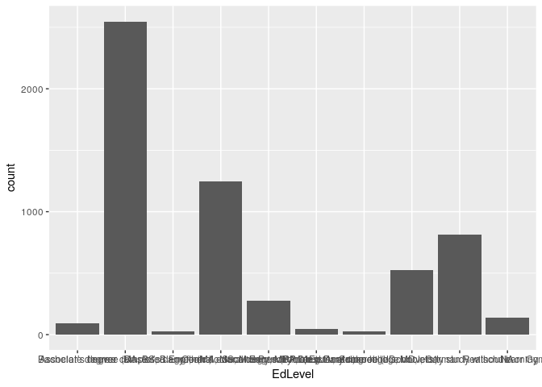
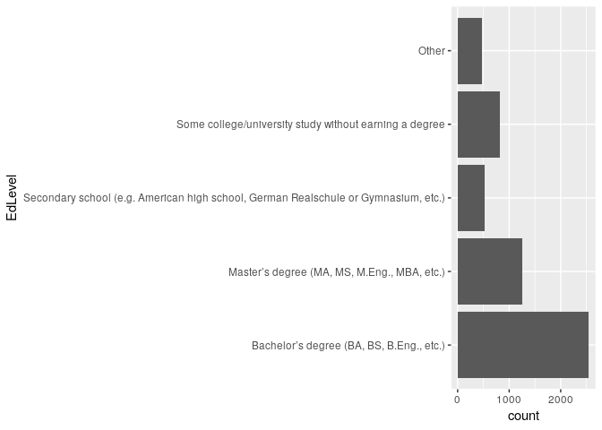
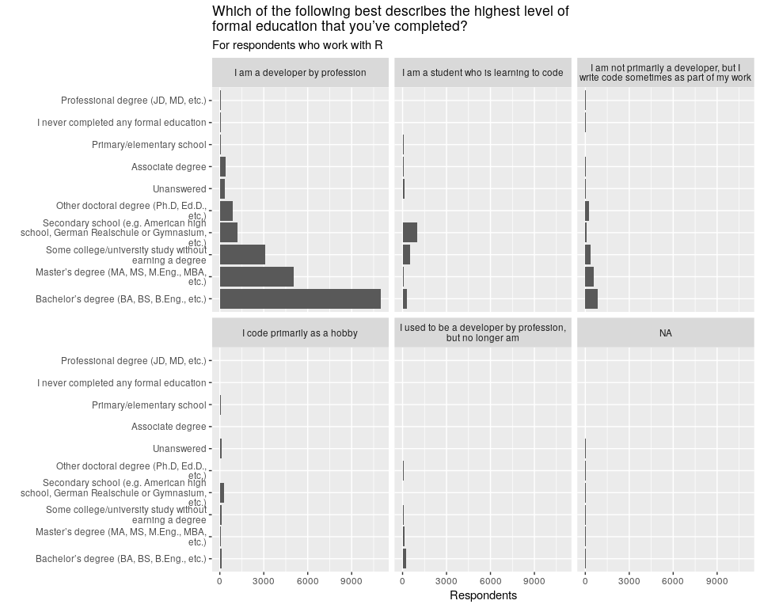

Intro to R
================
Mike Spencer
2nd July 2019

## Intro

*This is an R Markdown document. Markdown is a simple formatting syntax
for authoring HTML, PDF, and MS Word documents. For more details on
using R Markdown see <http://rmarkdown.rstudio.com>.*

We’re using <https://rstudio.cloud/> to host the workshop. The
conditions of use mean we can only use this for educational purposes.
It’s a great resource for teaching, but is underpowered for most
analysis. The big advantage is you can access RStudio through a web
browser without the need to install anything\!

The dataset you’ll be working with today is the developer survey from
Stackoverflow. You can download it from
<https://insights.stackoverflow.com/survey>.

## Help\!

… and further resources

  - `?Function`
  - <http://edinbr.org/> your local user group
  - <https://ourcodingclub.github.io/> coding club
  - <https://www.tidyverse.org/> help guides
  - <http://swcarpentry.github.io/r-novice-inflammation>
  - <https://datacarpentry.org/R-ecology-lesson/> or
    <https://datacarpentry.org/r-socialsci/>
  - <https://www.rstudio.com/resources/cheatsheets/>
  - <https://www.coursera.org/learn/r-programming?>
  - <https://r4ds.had.co.nz/>
  - <http://dx.doi.org/10.18637/jss.v059.i10> 131256 downloads for tidy
    data\!
  - <https://bitbucket.org/sruclees/help/wiki/Home> SRUC REES data wiki
  - SRUC R user group:
    <https://teams.microsoft.com/l/team/19%3a4492dd8b6fe24989a599ac8889dba374%40thread.skype/conversations?groupId=720f4eb2-1f80-4943-afa7-89f24b8b97c6&tenantId=c8542d98-e64c-446e-b8d5-0c98ffe56526>

## Language tips

  - functions end in ()
  - `?` before a function name for help
  - objects are plain text
  - %\>% sends output to next function
  - Wrap strings in "" or ’’
  - Separate arguments in function with a `,`
  - Use formatting to make code easier to read

## Packages

``` r
#install.packages("tidyverse")
library(tidyverse)
```

    ## Registered S3 methods overwritten by 'ggplot2':
    ##   method         from 
    ##   [.quosures     rlang
    ##   c.quosures     rlang
    ##   print.quosures rlang

    ## ── Attaching packages ─────────────────────────────────────────────────────────────────────────────────────── tidyverse 1.2.1 ──

    ## ✔ ggplot2 3.1.1     ✔ purrr   0.3.2
    ## ✔ tibble  2.1.1     ✔ dplyr   0.8.1
    ## ✔ tidyr   0.8.3     ✔ stringr 1.4.0
    ## ✔ readr   1.3.1     ✔ forcats 0.4.0

    ## ── Conflicts ────────────────────────────────────────────────────────────────────────────────────────── tidyverse_conflicts() ──
    ## ✖ dplyr::filter() masks stats::filter()
    ## ✖ dplyr::lag()    masks stats::lag()

## Data

### Read

``` r
df = read_csv("../data/survey_results_public_UK.csv")
```

    ## Parsed with column specification:
    ## cols(
    ##   .default = col_character(),
    ##   Respondent = col_double(),
    ##   CompTotal = col_double(),
    ##   ConvertedComp = col_double(),
    ##   WorkWeekHrs = col_double(),
    ##   CodeRevHrs = col_double(),
    ##   Age = col_double()
    ## )

    ## See spec(...) for full column specifications.

``` r
schema = read_csv("../data/survey_results_schema.csv")
```

    ## Parsed with column specification:
    ## cols(
    ##   Column = col_character(),
    ##   QuestionText = col_character()
    ## )

``` r
?read_csv
```

### Explore

  - See the `Environment` pane.
  - What did R return after each dataset was read?

<!-- end list -->

``` r
schema
```

    ## # A tibble: 85 x 2
    ##    Column        QuestionText                                              
    ##    <chr>         <chr>                                                     
    ##  1 Respondent    Randomized respondent ID number (not in order of survey r…
    ##  2 MainBranch    "Which of the following options best describes you today?…
    ##  3 Hobbyist      Do you code as a hobby?                                   
    ##  4 OpenSourcer   How often do you contribute to open source?               
    ##  5 OpenSource    How do you feel about the quality of open source software…
    ##  6 Employment    Which of the following best describes your current employ…
    ##  7 Country       In which country do you currently reside?                 
    ##  8 Student       Are you currently enrolled in a formal, degree-granting c…
    ##  9 EdLevel       Which of the following best describes the highest level o…
    ## 10 UndergradMaj… What was your main or most important field of study?      
    ## # … with 75 more rows

``` r
glimpse(df)
```

    ## Observations: 5,737
    ## Variables: 85
    ## $ Respondent             <dbl> 1, 16, 76, 80, 82, 94, 128, 164, 182, 188…
    ## $ MainBranch             <chr> "I am a student who is learning to code",…
    ## $ Hobbyist               <chr> "Yes", "Yes", "No", "Yes", "Yes", "Yes", …
    ## $ OpenSourcer            <chr> "Never", "Never", "Never", "Less than onc…
    ## $ OpenSource             <chr> "The quality of OSS and closed source sof…
    ## $ Employment             <chr> "Not employed, and not looking for work",…
    ## $ Country                <chr> "United Kingdom", "United Kingdom", "Unit…
    ## $ Student                <chr> "No", "No", "No", "No", "No", "No", "No",…
    ## $ EdLevel                <chr> "Primary/elementary school", "Master’s de…
    ## $ UndergradMajor         <chr> NA, NA, "Computer science, computer engin…
    ## $ EduOther               <chr> "Taught yourself a new language, framewor…
    ## $ OrgSize                <chr> NA, "100 to 499 employees", "20 to 99 emp…
    ## $ DevType                <chr> NA, "Developer, full-stack", "Developer, …
    ## $ YearsCode              <chr> "4", "10", "9", "1", "35", "7", "14", "23…
    ## $ Age1stCode             <chr> "10", "17", "23", "22", "14", "16", "14",…
    ## $ YearsCodePro           <chr> NA, "3", "5", "1", "27", "5", "10", "20",…
    ## $ CareerSat              <chr> NA, "Very satisfied", "Slightly satisfied…
    ## $ JobSat                 <chr> NA, "Slightly satisfied", "Very satisfied…
    ## $ MgrIdiot               <chr> NA, "Somewhat confident", "Very confident…
    ## $ MgrMoney               <chr> NA, "No", "Yes", "No", "Yes", "Yes", "No"…
    ## $ MgrWant                <chr> NA, "No", "Yes", "Yes", "No", "I am alrea…
    ## $ JobSeek                <chr> NA, "I’m not actively looking, but I am o…
    ## $ LastHireDate           <chr> NA, "3-4 years ago", "Less than a year ag…
    ## $ LastInt                <chr> NA, "Interview with people in senior / ma…
    ## $ FizzBuzz               <chr> NA, "Yes", "No", "No", "No", "Yes", "No",…
    ## $ JobFactors             <chr> NA, "Languages, frameworks, and other tec…
    ## $ ResumeUpdate           <chr> NA, "I heard about a job opportunity (fro…
    ## $ CurrencySymbol         <chr> NA, "GBP", "GBP", "GBP", "GBP", "GBP", "G…
    ## $ CurrencyDesc           <chr> NA, "Pound sterling", "Pound sterling", "…
    ## $ CompTotal              <dbl> NA, 29000, 30000, NA, 110000, 33000, 1060…
    ## $ CompFreq               <chr> NA, "Monthly", "Yearly", "Yearly", "Yearl…
    ## $ ConvertedComp          <dbl> NA, 455352, 39254, NA, 143932, 43180, 100…
    ## $ WorkWeekHrs            <dbl> NA, 40.0, 40.0, 50.0, 35.0, 44.0, 50.0, 3…
    ## $ WorkPlan               <chr> NA, "There is a schedule and/or spec (mad…
    ## $ WorkChallenge          <chr> NA, "Being tasked with non-development wo…
    ## $ WorkRemote             <chr> NA, "A few days each month", "Less than o…
    ## $ WorkLoc                <chr> NA, "Home", "Home", "Office", "Home", "Ho…
    ## $ ImpSyn                 <chr> NA, "Average", "Average", "A little above…
    ## $ CodeRev                <chr> NA, "No", "Yes, because I see value in co…
    ## $ CodeRevHrs             <dbl> NA, NA, 2, 3, 3, 2, 4, 2, NA, 1, NA, NA, …
    ## $ UnitTests              <chr> NA, "No, but I think we should", "Yes, it…
    ## $ PurchaseHow            <chr> NA, "Developers and management have nearl…
    ## $ PurchaseWhat           <chr> NA, "I have some influence", "I have some…
    ## $ LanguageWorkedWith     <chr> "HTML/CSS;Java;JavaScript;Python", "Bash/…
    ## $ LanguageDesireNextYear <chr> "C;C++;C#;Go;HTML/CSS;Java;JavaScript;Pyt…
    ## $ DatabaseWorkedWith     <chr> "SQLite", "MongoDB;Microsoft SQL Server;M…
    ## $ DatabaseDesireNextYear <chr> "MySQL", "Elasticsearch;MongoDB;Microsoft…
    ## $ PlatformWorkedWith     <chr> "MacOS;Windows", NA, "AWS", "Docker;Kuber…
    ## $ PlatformDesireNextYear <chr> "Android;Arduino;Windows", "AWS;Google Cl…
    ## $ WebFrameWorkedWith     <chr> "Django;Flask", "Angular/Angular.js;ASP.N…
    ## $ WebFrameDesireNextYear <chr> "Flask;jQuery", "Angular/Angular.js;ASP.N…
    ## $ MiscTechWorkedWith     <chr> "Node.js", ".NET;.NET Core;Node.js", NA, …
    ## $ MiscTechDesireNextYear <chr> "Node.js", ".NET Core;Node.js;React Nativ…
    ## $ DevEnviron             <chr> "IntelliJ;Notepad++;PyCharm", "Visual Stu…
    ## $ OpSys                  <chr> "Windows", "Windows", "Windows", "Windows…
    ## $ Containers             <chr> "I do not use containers", "I do not use …
    ## $ BlockchainOrg          <chr> NA, "Not at all", "Not at all", "Implemen…
    ## $ BlockchainIs           <chr> NA, "A passing fad", "Useful for decentra…
    ## $ BetterLife             <chr> "Yes", "No", "Yes", "Yes", "Yes", "Yes", …
    ## $ ITperson               <chr> "Fortunately, someone else has that title…
    ## $ OffOn                  <chr> "Yes", "No", "Yes", "No", NA, "Yes", "Yes…
    ## $ SocialMedia            <chr> "Twitter", "YouTube", "Facebook", "I don'…
    ## $ Extraversion           <chr> "Online", "Online", "In real life (in per…
    ## $ ScreenName             <chr> "Username", "Username", "Username", "User…
    ## $ SOVisit1st             <chr> "2017", "2010", "2010", "2010", "2012", "…
    ## $ SOVisitFreq            <chr> "A few times per month or weekly", "Multi…
    ## $ SOVisitTo              <chr> "Find answers to specific questions;Learn…
    ## $ SOFindAnswer           <chr> "3-5 times per week", "Less than once per…
    ## $ SOTimeSaved            <chr> "Stack Overflow was much faster", "Stack …
    ## $ SOHowMuchTime          <chr> "31-60 minutes", "11-30 minutes", "0-10 m…
    ## $ SOAccount              <chr> "No", "Yes", "Yes", "Not sure / can't rem…
    ## $ SOPartFreq             <chr> NA, "Less than once per month or monthly"…
    ## $ SOJobs                 <chr> "No, I didn't know that Stack Overflow ha…
    ## $ EntTeams               <chr> "No, and I don't know what those are", "N…
    ## $ SOComm                 <chr> "Neutral", "Yes, somewhat", "Neutral", "N…
    ## $ WelcomeChange          <chr> "Just as welcome now as I felt last year"…
    ## $ SONewContent           <chr> "Tech articles written by other developer…
    ## $ Age                    <dbl> 14, 26, 32, 24, NA, 27, 30, 47, 18, 28, 5…
    ## $ Gender                 <chr> "Man", "Man", "Man", "Man", "Man", "Man",…
    ## $ Trans                  <chr> "No", "No", "No", "No", "No", "No", "No",…
    ## $ Sexuality              <chr> "Straight / Heterosexual", "Straight / He…
    ## $ Ethnicity              <chr> NA, "White or of European descent", "Whit…
    ## $ Dependents             <chr> "No", "No", "Yes", "No", "No", "No", "Yes…
    ## $ SurveyLength           <chr> "Appropriate in length", "Appropriate in …
    ## $ SurveyEase             <chr> "Neither easy nor difficult", "Neither ea…

``` r
summary(df)
```

    ##    Respondent     MainBranch          Hobbyist         OpenSourcer       
    ##  Min.   :    1   Length:5737        Length:5737        Length:5737       
    ##  1st Qu.:22413   Class :character   Class :character   Class :character  
    ##  Median :44854   Mode  :character   Mode  :character   Mode  :character  
    ##  Mean   :44599                                                           
    ##  3rd Qu.:66895                                                           
    ##  Max.   :88833                                                           
    ##                                                                          
    ##   OpenSource         Employment          Country         
    ##  Length:5737        Length:5737        Length:5737       
    ##  Class :character   Class :character   Class :character  
    ##  Mode  :character   Mode  :character   Mode  :character  
    ##                                                          
    ##                                                          
    ##                                                          
    ##                                                          
    ##    Student            EdLevel          UndergradMajor    
    ##  Length:5737        Length:5737        Length:5737       
    ##  Class :character   Class :character   Class :character  
    ##  Mode  :character   Mode  :character   Mode  :character  
    ##                                                          
    ##                                                          
    ##                                                          
    ##                                                          
    ##    EduOther           OrgSize            DevType         
    ##  Length:5737        Length:5737        Length:5737       
    ##  Class :character   Class :character   Class :character  
    ##  Mode  :character   Mode  :character   Mode  :character  
    ##                                                          
    ##                                                          
    ##                                                          
    ##                                                          
    ##   YearsCode          Age1stCode        YearsCodePro      
    ##  Length:5737        Length:5737        Length:5737       
    ##  Class :character   Class :character   Class :character  
    ##  Mode  :character   Mode  :character   Mode  :character  
    ##                                                          
    ##                                                          
    ##                                                          
    ##                                                          
    ##   CareerSat            JobSat            MgrIdiot        
    ##  Length:5737        Length:5737        Length:5737       
    ##  Class :character   Class :character   Class :character  
    ##  Mode  :character   Mode  :character   Mode  :character  
    ##                                                          
    ##                                                          
    ##                                                          
    ##                                                          
    ##    MgrMoney           MgrWant            JobSeek         
    ##  Length:5737        Length:5737        Length:5737       
    ##  Class :character   Class :character   Class :character  
    ##  Mode  :character   Mode  :character   Mode  :character  
    ##                                                          
    ##                                                          
    ##                                                          
    ##                                                          
    ##  LastHireDate         LastInt            FizzBuzz        
    ##  Length:5737        Length:5737        Length:5737       
    ##  Class :character   Class :character   Class :character  
    ##  Mode  :character   Mode  :character   Mode  :character  
    ##                                                          
    ##                                                          
    ##                                                          
    ##                                                          
    ##   JobFactors        ResumeUpdate       CurrencySymbol    
    ##  Length:5737        Length:5737        Length:5737       
    ##  Class :character   Class :character   Class :character  
    ##  Mode  :character   Mode  :character   Mode  :character  
    ##                                                          
    ##                                                          
    ##                                                          
    ##                                                          
    ##  CurrencyDesc         CompTotal           CompFreq        
    ##  Length:5737        Min.   :        0   Length:5737       
    ##  Class :character   1st Qu.:    30760   Class :character  
    ##  Mode  :character   Median :    45000   Mode  :character  
    ##                     Mean   :   168297                     
    ##                     3rd Qu.:    60000                     
    ##                     Max.   :474754456                     
    ##                     NA's   :1692                          
    ##  ConvertedComp      WorkWeekHrs       WorkPlan         WorkChallenge     
    ##  Min.   :      0   Min.   :  3.50   Length:5737        Length:5737       
    ##  1st Qu.:  45797   1st Qu.: 37.50   Class :character   Class :character  
    ##  Median :  68041   Median : 40.00   Mode  :character   Mode  :character  
    ##  Mean   : 166182   Mean   : 39.55                                        
    ##  3rd Qu.: 117763   3rd Qu.: 40.00                                        
    ##  Max.   :2000000   Max.   :375.00                                        
    ##  NA's   :1703      NA's   :1232                                          
    ##   WorkRemote          WorkLoc             ImpSyn         
    ##  Length:5737        Length:5737        Length:5737       
    ##  Class :character   Class :character   Class :character  
    ##  Mode  :character   Mode  :character   Mode  :character  
    ##                                                          
    ##                                                          
    ##                                                          
    ##                                                          
    ##    CodeRev            CodeRevHrs      UnitTests         PurchaseHow       
    ##  Length:5737        Min.   : 0.000   Length:5737        Length:5737       
    ##  Class :character   1st Qu.: 2.000   Class :character   Class :character  
    ##  Mode  :character   Median : 3.000   Mode  :character   Mode  :character  
    ##                     Mean   : 4.053                                        
    ##                     3rd Qu.: 5.000                                        
    ##                     Max.   :40.000                                        
    ##                     NA's   :2262                                          
    ##  PurchaseWhat       LanguageWorkedWith LanguageDesireNextYear
    ##  Length:5737        Length:5737        Length:5737           
    ##  Class :character   Class :character   Class :character      
    ##  Mode  :character   Mode  :character   Mode  :character      
    ##                                                              
    ##                                                              
    ##                                                              
    ##                                                              
    ##  DatabaseWorkedWith DatabaseDesireNextYear PlatformWorkedWith
    ##  Length:5737        Length:5737            Length:5737       
    ##  Class :character   Class :character       Class :character  
    ##  Mode  :character   Mode  :character       Mode  :character  
    ##                                                              
    ##                                                              
    ##                                                              
    ##                                                              
    ##  PlatformDesireNextYear WebFrameWorkedWith WebFrameDesireNextYear
    ##  Length:5737            Length:5737        Length:5737           
    ##  Class :character       Class :character   Class :character      
    ##  Mode  :character       Mode  :character   Mode  :character      
    ##                                                                  
    ##                                                                  
    ##                                                                  
    ##                                                                  
    ##  MiscTechWorkedWith MiscTechDesireNextYear  DevEnviron       
    ##  Length:5737        Length:5737            Length:5737       
    ##  Class :character   Class :character       Class :character  
    ##  Mode  :character   Mode  :character       Mode  :character  
    ##                                                              
    ##                                                              
    ##                                                              
    ##                                                              
    ##     OpSys            Containers        BlockchainOrg     
    ##  Length:5737        Length:5737        Length:5737       
    ##  Class :character   Class :character   Class :character  
    ##  Mode  :character   Mode  :character   Mode  :character  
    ##                                                          
    ##                                                          
    ##                                                          
    ##                                                          
    ##  BlockchainIs        BetterLife          ITperson        
    ##  Length:5737        Length:5737        Length:5737       
    ##  Class :character   Class :character   Class :character  
    ##  Mode  :character   Mode  :character   Mode  :character  
    ##                                                          
    ##                                                          
    ##                                                          
    ##                                                          
    ##     OffOn           SocialMedia        Extraversion      
    ##  Length:5737        Length:5737        Length:5737       
    ##  Class :character   Class :character   Class :character  
    ##  Mode  :character   Mode  :character   Mode  :character  
    ##                                                          
    ##                                                          
    ##                                                          
    ##                                                          
    ##   ScreenName         SOVisit1st        SOVisitFreq       
    ##  Length:5737        Length:5737        Length:5737       
    ##  Class :character   Class :character   Class :character  
    ##  Mode  :character   Mode  :character   Mode  :character  
    ##                                                          
    ##                                                          
    ##                                                          
    ##                                                          
    ##   SOVisitTo         SOFindAnswer       SOTimeSaved       
    ##  Length:5737        Length:5737        Length:5737       
    ##  Class :character   Class :character   Class :character  
    ##  Mode  :character   Mode  :character   Mode  :character  
    ##                                                          
    ##                                                          
    ##                                                          
    ##                                                          
    ##  SOHowMuchTime       SOAccount          SOPartFreq       
    ##  Length:5737        Length:5737        Length:5737       
    ##  Class :character   Class :character   Class :character  
    ##  Mode  :character   Mode  :character   Mode  :character  
    ##                                                          
    ##                                                          
    ##                                                          
    ##                                                          
    ##     SOJobs            EntTeams            SOComm         
    ##  Length:5737        Length:5737        Length:5737       
    ##  Class :character   Class :character   Class :character  
    ##  Mode  :character   Mode  :character   Mode  :character  
    ##                                                          
    ##                                                          
    ##                                                          
    ##                                                          
    ##  WelcomeChange      SONewContent            Age           Gender         
    ##  Length:5737        Length:5737        Min.   : 2.00   Length:5737       
    ##  Class :character   Class :character   1st Qu.:25.00   Class :character  
    ##  Mode  :character   Mode  :character   Median :30.00   Mode  :character  
    ##                                        Mean   :32.24                     
    ##                                        3rd Qu.:38.00                     
    ##                                        Max.   :91.00                     
    ##                                        NA's   :475                       
    ##     Trans            Sexuality          Ethnicity        
    ##  Length:5737        Length:5737        Length:5737       
    ##  Class :character   Class :character   Class :character  
    ##  Mode  :character   Mode  :character   Mode  :character  
    ##                                                          
    ##                                                          
    ##                                                          
    ##                                                          
    ##   Dependents        SurveyLength        SurveyEase       
    ##  Length:5737        Length:5737        Length:5737       
    ##  Class :character   Class :character   Class :character  
    ##  Mode  :character   Mode  :character   Mode  :character  
    ##                                                          
    ##                                                          
    ##                                                          
    ## 

``` r
# View(df)
colnames(df)
```

    ##  [1] "Respondent"             "MainBranch"            
    ##  [3] "Hobbyist"               "OpenSourcer"           
    ##  [5] "OpenSource"             "Employment"            
    ##  [7] "Country"                "Student"               
    ##  [9] "EdLevel"                "UndergradMajor"        
    ## [11] "EduOther"               "OrgSize"               
    ## [13] "DevType"                "YearsCode"             
    ## [15] "Age1stCode"             "YearsCodePro"          
    ## [17] "CareerSat"              "JobSat"                
    ## [19] "MgrIdiot"               "MgrMoney"              
    ## [21] "MgrWant"                "JobSeek"               
    ## [23] "LastHireDate"           "LastInt"               
    ## [25] "FizzBuzz"               "JobFactors"            
    ## [27] "ResumeUpdate"           "CurrencySymbol"        
    ## [29] "CurrencyDesc"           "CompTotal"             
    ## [31] "CompFreq"               "ConvertedComp"         
    ## [33] "WorkWeekHrs"            "WorkPlan"              
    ## [35] "WorkChallenge"          "WorkRemote"            
    ## [37] "WorkLoc"                "ImpSyn"                
    ## [39] "CodeRev"                "CodeRevHrs"            
    ## [41] "UnitTests"              "PurchaseHow"           
    ## [43] "PurchaseWhat"           "LanguageWorkedWith"    
    ## [45] "LanguageDesireNextYear" "DatabaseWorkedWith"    
    ## [47] "DatabaseDesireNextYear" "PlatformWorkedWith"    
    ## [49] "PlatformDesireNextYear" "WebFrameWorkedWith"    
    ## [51] "WebFrameDesireNextYear" "MiscTechWorkedWith"    
    ## [53] "MiscTechDesireNextYear" "DevEnviron"            
    ## [55] "OpSys"                  "Containers"            
    ## [57] "BlockchainOrg"          "BlockchainIs"          
    ## [59] "BetterLife"             "ITperson"              
    ## [61] "OffOn"                  "SocialMedia"           
    ## [63] "Extraversion"           "ScreenName"            
    ## [65] "SOVisit1st"             "SOVisitFreq"           
    ## [67] "SOVisitTo"              "SOFindAnswer"          
    ## [69] "SOTimeSaved"            "SOHowMuchTime"         
    ## [71] "SOAccount"              "SOPartFreq"            
    ## [73] "SOJobs"                 "EntTeams"              
    ## [75] "SOComm"                 "WelcomeChange"         
    ## [77] "SONewContent"           "Age"                   
    ## [79] "Gender"                 "Trans"                 
    ## [81] "Sexuality"              "Ethnicity"             
    ## [83] "Dependents"             "SurveyLength"          
    ## [85] "SurveyEase"

## Building blocks

### Select columns

``` r
df %>% 
   select(Employment, Ethnicity)
```

    ## # A tibble: 5,737 x 2
    ##    Employment                             Ethnicity                   
    ##    <chr>                                  <chr>                       
    ##  1 Not employed, and not looking for work <NA>                        
    ##  2 Employed full-time                     White or of European descent
    ##  3 Employed full-time                     White or of European descent
    ##  4 Employed full-time                     Biracial                    
    ##  5 Employed full-time                     <NA>                        
    ##  6 Employed full-time                     White or of European descent
    ##  7 Employed full-time                     White or of European descent
    ##  8 Employed full-time                     White or of European descent
    ##  9 Employed full-time                     White or of European descent
    ## 10 Employed full-time                     South Asian                 
    ## # … with 5,727 more rows

``` r
df %>% 
   select(-Respondent)
```

    ## # A tibble: 5,737 x 84
    ##    MainBranch Hobbyist OpenSourcer OpenSource Employment Country Student
    ##    <chr>      <chr>    <chr>       <chr>      <chr>      <chr>   <chr>  
    ##  1 I am a st… Yes      Never       The quali… Not emplo… United… No     
    ##  2 I am a de… Yes      Never       The quali… Employed … United… No     
    ##  3 I am a de… No       Never       The quali… Employed … United… No     
    ##  4 I am a de… Yes      Less than … OSS is, o… Employed … United… No     
    ##  5 I am a de… Yes      Once a mon… OSS is, o… Employed … United… No     
    ##  6 I am a de… Yes      Never       OSS is, o… Employed … United… No     
    ##  7 I am not … Yes      Once a mon… OSS is, o… Employed … United… No     
    ##  8 I am a de… Yes      Never       The quali… Employed … United… No     
    ##  9 I code pr… Yes      Less than … OSS is, o… Employed … United… Yes, f…
    ## 10 I am a de… Yes      Never       OSS is, o… Employed … United… Yes, p…
    ## # … with 5,727 more rows, and 77 more variables: EdLevel <chr>,
    ## #   UndergradMajor <chr>, EduOther <chr>, OrgSize <chr>, DevType <chr>,
    ## #   YearsCode <chr>, Age1stCode <chr>, YearsCodePro <chr>,
    ## #   CareerSat <chr>, JobSat <chr>, MgrIdiot <chr>, MgrMoney <chr>,
    ## #   MgrWant <chr>, JobSeek <chr>, LastHireDate <chr>, LastInt <chr>,
    ## #   FizzBuzz <chr>, JobFactors <chr>, ResumeUpdate <chr>,
    ## #   CurrencySymbol <chr>, CurrencyDesc <chr>, CompTotal <dbl>,
    ## #   CompFreq <chr>, ConvertedComp <dbl>, WorkWeekHrs <dbl>,
    ## #   WorkPlan <chr>, WorkChallenge <chr>, WorkRemote <chr>, WorkLoc <chr>,
    ## #   ImpSyn <chr>, CodeRev <chr>, CodeRevHrs <dbl>, UnitTests <chr>,
    ## #   PurchaseHow <chr>, PurchaseWhat <chr>, LanguageWorkedWith <chr>,
    ## #   LanguageDesireNextYear <chr>, DatabaseWorkedWith <chr>,
    ## #   DatabaseDesireNextYear <chr>, PlatformWorkedWith <chr>,
    ## #   PlatformDesireNextYear <chr>, WebFrameWorkedWith <chr>,
    ## #   WebFrameDesireNextYear <chr>, MiscTechWorkedWith <chr>,
    ## #   MiscTechDesireNextYear <chr>, DevEnviron <chr>, OpSys <chr>,
    ## #   Containers <chr>, BlockchainOrg <chr>, BlockchainIs <chr>,
    ## #   BetterLife <chr>, ITperson <chr>, OffOn <chr>, SocialMedia <chr>,
    ## #   Extraversion <chr>, ScreenName <chr>, SOVisit1st <chr>,
    ## #   SOVisitFreq <chr>, SOVisitTo <chr>, SOFindAnswer <chr>,
    ## #   SOTimeSaved <chr>, SOHowMuchTime <chr>, SOAccount <chr>,
    ## #   SOPartFreq <chr>, SOJobs <chr>, EntTeams <chr>, SOComm <chr>,
    ## #   WelcomeChange <chr>, SONewContent <chr>, Age <dbl>, Gender <chr>,
    ## #   Trans <chr>, Sexuality <chr>, Ethnicity <chr>, Dependents <chr>,
    ## #   SurveyLength <chr>, SurveyEase <chr>

### Filter rows

``` r
df %>% 
   filter(Employment == "Not employed, but looking for work")
```

    ## # A tibble: 171 x 85
    ##    Respondent MainBranch Hobbyist OpenSourcer OpenSource Employment Country
    ##         <dbl> <chr>      <chr>    <chr>       <chr>      <chr>      <chr>  
    ##  1       2534 I am a de… Yes      Less than … The quali… Not emplo… United…
    ##  2       2684 I am a st… Yes      Never       <NA>       Not emplo… United…
    ##  3       3559 I am a st… Yes      Never       OSS is, o… Not emplo… United…
    ##  4       4148 I am a st… No       Never       OSS is, o… Not emplo… United…
    ##  5       4781 I am a st… No       Never       The quali… Not emplo… United…
    ##  6       4952 I am a st… Yes      Less than … OSS is, o… Not emplo… United…
    ##  7       5705 I am a st… Yes      Less than … OSS is, o… Not emplo… United…
    ##  8       6334 I code pr… Yes      Never       The quali… Not emplo… United…
    ##  9       6822 I am a st… Yes      Never       The quali… Not emplo… United…
    ## 10       7293 I am a st… Yes      Less than … OSS is, o… Not emplo… United…
    ## # … with 161 more rows, and 78 more variables: Student <chr>,
    ## #   EdLevel <chr>, UndergradMajor <chr>, EduOther <chr>, OrgSize <chr>,
    ## #   DevType <chr>, YearsCode <chr>, Age1stCode <chr>, YearsCodePro <chr>,
    ## #   CareerSat <chr>, JobSat <chr>, MgrIdiot <chr>, MgrMoney <chr>,
    ## #   MgrWant <chr>, JobSeek <chr>, LastHireDate <chr>, LastInt <chr>,
    ## #   FizzBuzz <chr>, JobFactors <chr>, ResumeUpdate <chr>,
    ## #   CurrencySymbol <chr>, CurrencyDesc <chr>, CompTotal <dbl>,
    ## #   CompFreq <chr>, ConvertedComp <dbl>, WorkWeekHrs <dbl>,
    ## #   WorkPlan <chr>, WorkChallenge <chr>, WorkRemote <chr>, WorkLoc <chr>,
    ## #   ImpSyn <chr>, CodeRev <chr>, CodeRevHrs <dbl>, UnitTests <chr>,
    ## #   PurchaseHow <chr>, PurchaseWhat <chr>, LanguageWorkedWith <chr>,
    ## #   LanguageDesireNextYear <chr>, DatabaseWorkedWith <chr>,
    ## #   DatabaseDesireNextYear <chr>, PlatformWorkedWith <chr>,
    ## #   PlatformDesireNextYear <chr>, WebFrameWorkedWith <chr>,
    ## #   WebFrameDesireNextYear <chr>, MiscTechWorkedWith <chr>,
    ## #   MiscTechDesireNextYear <chr>, DevEnviron <chr>, OpSys <chr>,
    ## #   Containers <chr>, BlockchainOrg <chr>, BlockchainIs <chr>,
    ## #   BetterLife <chr>, ITperson <chr>, OffOn <chr>, SocialMedia <chr>,
    ## #   Extraversion <chr>, ScreenName <chr>, SOVisit1st <chr>,
    ## #   SOVisitFreq <chr>, SOVisitTo <chr>, SOFindAnswer <chr>,
    ## #   SOTimeSaved <chr>, SOHowMuchTime <chr>, SOAccount <chr>,
    ## #   SOPartFreq <chr>, SOJobs <chr>, EntTeams <chr>, SOComm <chr>,
    ## #   WelcomeChange <chr>, SONewContent <chr>, Age <dbl>, Gender <chr>,
    ## #   Trans <chr>, Sexuality <chr>, Ethnicity <chr>, Dependents <chr>,
    ## #   SurveyLength <chr>, SurveyEase <chr>

``` r
df %>% 
   filter(Employment != "Not employed, but looking for work")
```

    ## # A tibble: 5,495 x 85
    ##    Respondent MainBranch Hobbyist OpenSourcer OpenSource Employment Country
    ##         <dbl> <chr>      <chr>    <chr>       <chr>      <chr>      <chr>  
    ##  1          1 I am a st… Yes      Never       The quali… Not emplo… United…
    ##  2         16 I am a de… Yes      Never       The quali… Employed … United…
    ##  3         76 I am a de… No       Never       The quali… Employed … United…
    ##  4         80 I am a de… Yes      Less than … OSS is, o… Employed … United…
    ##  5         82 I am a de… Yes      Once a mon… OSS is, o… Employed … United…
    ##  6         94 I am a de… Yes      Never       OSS is, o… Employed … United…
    ##  7        128 I am not … Yes      Once a mon… OSS is, o… Employed … United…
    ##  8        164 I am a de… Yes      Never       The quali… Employed … United…
    ##  9        182 I code pr… Yes      Less than … OSS is, o… Employed … United…
    ## 10        188 I am a de… Yes      Never       OSS is, o… Employed … United…
    ## # … with 5,485 more rows, and 78 more variables: Student <chr>,
    ## #   EdLevel <chr>, UndergradMajor <chr>, EduOther <chr>, OrgSize <chr>,
    ## #   DevType <chr>, YearsCode <chr>, Age1stCode <chr>, YearsCodePro <chr>,
    ## #   CareerSat <chr>, JobSat <chr>, MgrIdiot <chr>, MgrMoney <chr>,
    ## #   MgrWant <chr>, JobSeek <chr>, LastHireDate <chr>, LastInt <chr>,
    ## #   FizzBuzz <chr>, JobFactors <chr>, ResumeUpdate <chr>,
    ## #   CurrencySymbol <chr>, CurrencyDesc <chr>, CompTotal <dbl>,
    ## #   CompFreq <chr>, ConvertedComp <dbl>, WorkWeekHrs <dbl>,
    ## #   WorkPlan <chr>, WorkChallenge <chr>, WorkRemote <chr>, WorkLoc <chr>,
    ## #   ImpSyn <chr>, CodeRev <chr>, CodeRevHrs <dbl>, UnitTests <chr>,
    ## #   PurchaseHow <chr>, PurchaseWhat <chr>, LanguageWorkedWith <chr>,
    ## #   LanguageDesireNextYear <chr>, DatabaseWorkedWith <chr>,
    ## #   DatabaseDesireNextYear <chr>, PlatformWorkedWith <chr>,
    ## #   PlatformDesireNextYear <chr>, WebFrameWorkedWith <chr>,
    ## #   WebFrameDesireNextYear <chr>, MiscTechWorkedWith <chr>,
    ## #   MiscTechDesireNextYear <chr>, DevEnviron <chr>, OpSys <chr>,
    ## #   Containers <chr>, BlockchainOrg <chr>, BlockchainIs <chr>,
    ## #   BetterLife <chr>, ITperson <chr>, OffOn <chr>, SocialMedia <chr>,
    ## #   Extraversion <chr>, ScreenName <chr>, SOVisit1st <chr>,
    ## #   SOVisitFreq <chr>, SOVisitTo <chr>, SOFindAnswer <chr>,
    ## #   SOTimeSaved <chr>, SOHowMuchTime <chr>, SOAccount <chr>,
    ## #   SOPartFreq <chr>, SOJobs <chr>, EntTeams <chr>, SOComm <chr>,
    ## #   WelcomeChange <chr>, SONewContent <chr>, Age <dbl>, Gender <chr>,
    ## #   Trans <chr>, Sexuality <chr>, Ethnicity <chr>, Dependents <chr>,
    ## #   SurveyLength <chr>, SurveyEase <chr>

### Count observations

``` r
df %>% 
   count(Employment)
```

    ## # A tibble: 7 x 2
    ##   Employment                                               n
    ##   <chr>                                                <int>
    ## 1 <NA>                                                    71
    ## 2 Employed full-time                                    4458
    ## 3 Employed part-time                                     120
    ## 4 Independent contractor, freelancer, or self-employed   614
    ## 5 Not employed, and not looking for work                 261
    ## 6 Not employed, but looking for work                     171
    ## 7 Retired                                                 42

``` r
df %>% 
   count(Employment, Ethnicity)
```

    ## # A tibble: 106 x 3
    ##    Employment       Ethnicity                                             n
    ##    <chr>            <chr>                                             <int>
    ##  1 <NA>             <NA>                                                 14
    ##  2 <NA>             Biracial                                              1
    ##  3 <NA>             Black or of African descent;East Asian;Hispanic …     2
    ##  4 <NA>             Black or of African descent;White or of European…     1
    ##  5 <NA>             East Asian                                            1
    ##  6 <NA>             Middle Eastern                                        1
    ##  7 <NA>             South Asian                                           2
    ##  8 <NA>             White or of European descent                         48
    ##  9 <NA>             White or of European descent;Biracial                 1
    ## 10 Employed full-t… <NA>                                                270
    ## # … with 96 more rows

``` r
df %>% 
   drop_na() %>% 
   count(Employment, Ethnicity)
```

    ## # A tibble: 12 x 3
    ##    Employment        Ethnicity                                            n
    ##    <chr>             <chr>                                            <int>
    ##  1 Employed full-ti… Biracial                                             1
    ##  2 Employed full-ti… Black or of African descent                          2
    ##  3 Employed full-ti… East Asian                                           3
    ##  4 Employed full-ti… Hispanic or Latino/Latina                            2
    ##  5 Employed full-ti… Hispanic or Latino/Latina;White or of European …     1
    ##  6 Employed full-ti… Middle Eastern                                       4
    ##  7 Employed full-ti… Multiracial                                          2
    ##  8 Employed full-ti… South Asian                                         11
    ##  9 Employed full-ti… South Asian;White or of European descent             1
    ## 10 Employed full-ti… South Asian;White or of European descent;Multir…     1
    ## 11 Employed full-ti… White or of European descent                       244
    ## 12 Employed part-ti… White or of European descent                         2

### Sort data

``` r
df %>% 
   count(Employment) %>% 
   arrange(desc(n))
```

    ## # A tibble: 7 x 2
    ##   Employment                                               n
    ##   <chr>                                                <int>
    ## 1 Employed full-time                                    4458
    ## 2 Independent contractor, freelancer, or self-employed   614
    ## 3 Not employed, and not looking for work                 261
    ## 4 Not employed, but looking for work                     171
    ## 5 Employed part-time                                     120
    ## 6 <NA>                                                    71
    ## 7 Retired                                                 42

### Add/change variables

``` r
df %>% 
   select(WorkWeekHrs) %>% 
   mutate(work_week = WorkWeekHrs / (24 * 7))
```

    ## # A tibble: 5,737 x 2
    ##    WorkWeekHrs work_week
    ##          <dbl>     <dbl>
    ##  1          NA    NA    
    ##  2          40     0.238
    ##  3          40     0.238
    ##  4          50     0.298
    ##  5          35     0.208
    ##  6          44     0.262
    ##  7          50     0.298
    ##  8          38     0.226
    ##  9          NA    NA    
    ## 10          42     0.25 
    ## # … with 5,727 more rows

### Summarise

Similar to mutate, but collapses results

``` r
df %>% 
   group_by(EdLevel) %>% 
   summarise(hrs = mean(WorkWeekHrs))
```

    ## # A tibble: 10 x 2
    ##    EdLevel                                                              hrs
    ##    <chr>                                                              <dbl>
    ##  1 <NA>                                                                  NA
    ##  2 Associate degree                                                      NA
    ##  3 Bachelor’s degree (BA, BS, B.Eng., etc.)                              NA
    ##  4 I never completed any formal education                                NA
    ##  5 Master’s degree (MA, MS, M.Eng., MBA, etc.)                           NA
    ##  6 Other doctoral degree (Ph.D, Ed.D., etc.)                             NA
    ##  7 Primary/elementary school                                             NA
    ##  8 Professional degree (JD, MD, etc.)                                    NA
    ##  9 Secondary school (e.g. American high school, German Realschule or…    NA
    ## 10 Some college/university study without earning a degree                NA

``` r
df %>% 
   drop_na(EdLevel, WorkWeekHrs) %>% 
   group_by(EdLevel) %>% 
   summarise(hrs = mean(WorkWeekHrs))
```

    ## # A tibble: 9 x 2
    ##   EdLevel                                                               hrs
    ##   <chr>                                                               <dbl>
    ## 1 Associate degree                                                     38.7
    ## 2 Bachelor’s degree (BA, BS, B.Eng., etc.)                             39.3
    ## 3 I never completed any formal education                               49.3
    ## 4 Master’s degree (MA, MS, M.Eng., MBA, etc.)                          39.7
    ## 5 Other doctoral degree (Ph.D, Ed.D., etc.)                            40.6
    ## 6 Primary/elementary school                                            37.4
    ## 7 Professional degree (JD, MD, etc.)                                   43  
    ## 8 Secondary school (e.g. American high school, German Realschule or …  39.3
    ## 9 Some college/university study without earning a degree               39.9

``` r
df %>% 
   drop_na(EdLevel, WorkWeekHrs) %>% 
   group_by(EdLevel) %>% 
   summarise(hrs = mean(WorkWeekHrs)) %>% 
   arrange(desc(hrs))
```

    ## # A tibble: 9 x 2
    ##   EdLevel                                                               hrs
    ##   <chr>                                                               <dbl>
    ## 1 I never completed any formal education                               49.3
    ## 2 Professional degree (JD, MD, etc.)                                   43  
    ## 3 Other doctoral degree (Ph.D, Ed.D., etc.)                            40.6
    ## 4 Some college/university study without earning a degree               39.9
    ## 5 Master’s degree (MA, MS, M.Eng., MBA, etc.)                          39.7
    ## 6 Secondary school (e.g. American high school, German Realschule or …  39.3
    ## 7 Bachelor’s degree (BA, BS, B.Eng., etc.)                             39.3
    ## 8 Associate degree                                                     38.7
    ## 9 Primary/elementary school                                            37.4

``` r
df %>% 
   drop_na(EdLevel, WorkWeekHrs) %>% 
   group_by(EdLevel) %>% 
   summarise(hrs = mean(WorkWeekHrs),
             n = n()) %>% 
   arrange(desc(hrs))
```

    ## # A tibble: 9 x 3
    ##   EdLevel                                                         hrs     n
    ##   <chr>                                                         <dbl> <int>
    ## 1 I never completed any formal education                         49.3    14
    ## 2 Professional degree (JD, MD, etc.)                             43      16
    ## 3 Other doctoral degree (Ph.D, Ed.D., etc.)                      40.6   235
    ## 4 Some college/university study without earning a degree         39.9   610
    ## 5 Master’s degree (MA, MS, M.Eng., MBA, etc.)                    39.7  1063
    ## 6 Secondary school (e.g. American high school, German Realschu…  39.3   223
    ## 7 Bachelor’s degree (BA, BS, B.Eng., etc.)                       39.3  2194
    ## 8 Associate degree                                               38.7    67
    ## 9 Primary/elementary school                                      37.4    10

``` r
df %>% 
   drop_na(EdLevel, WorkWeekHrs) %>% 
   group_by(EdLevel) %>% 
   summarise(hrs = mean(WorkWeekHrs),
             n = n()) %>% 
   arrange(desc(hrs)) %>% 
   filter(n > 10)
```

    ## # A tibble: 8 x 3
    ##   EdLevel                                                         hrs     n
    ##   <chr>                                                         <dbl> <int>
    ## 1 I never completed any formal education                         49.3    14
    ## 2 Professional degree (JD, MD, etc.)                             43      16
    ## 3 Other doctoral degree (Ph.D, Ed.D., etc.)                      40.6   235
    ## 4 Some college/university study without earning a degree         39.9   610
    ## 5 Master’s degree (MA, MS, M.Eng., MBA, etc.)                    39.7  1063
    ## 6 Secondary school (e.g. American high school, German Realschu…  39.3   223
    ## 7 Bachelor’s degree (BA, BS, B.Eng., etc.)                       39.3  2194
    ## 8 Associate degree                                               38.7    67

Could do that fancy Bayes trick here…
<http://store.varianceexplained.org/>

## Plotting

Reiterate the tidyverse pages:
<https://ggplot2.tidyverse.org/reference/>

``` r
ggplot(df, aes(EdLevel)) +
   geom_bar()
```

<!-- -->

``` r
df %>% 
   mutate(EdLevel = fct_lump(EdLevel, 4)) %>% 
   ggplot(aes(EdLevel)) +
   geom_bar()
```

<!-- -->

``` r
df %>% 
   drop_na(EdLevel) %>% 
   mutate(EdLevel = fct_lump(EdLevel, 4)) %>% 
   ggplot(aes(EdLevel)) +
   geom_bar() +
   coord_flip()
```

<!-- -->

``` r
df %>% 
   drop_na(EdLevel) %>% 
   mutate(EdLevel = fct_lump(EdLevel, 4)) %>% 
   ggplot(aes(EdLevel)) +
   geom_bar() +
   coord_flip() +
   labs(title = "Survey respondents",
        x = "",
        y = "Respondents")
```

<!-- -->

``` r
df %>% 
   drop_na(EdLevel) %>% 
   mutate(EdLevel = fct_lump(EdLevel, 4),
          EdLevel = fct_infreq(EdLevel)) %>% 
   ggplot(aes(EdLevel)) +
   geom_bar() +
   coord_flip() +
   labs(title = "Survey respondents",
        x = "",
        y = "Respondents")
```

<!-- -->

``` r
df %>% 
   drop_na(EdLevel) %>% 
   mutate(EdLevel = fct_lump(EdLevel, 4),
          EdLevel = fct_infreq(EdLevel)) %>% 
   ggplot(aes(EdLevel)) +
   geom_bar(fill = "#75ab42") +
   coord_flip() +
   labs(title = "Survey respondents education",
        x = "",
        y = "Respondents") +
   theme_light()
```

<!-- -->

``` r
df %>% 
   drop_na(EdLevel) %>% 
   mutate(EdLevel = fct_lump(EdLevel, 4),
          EdLevel = str_wrap(EdLevel, width = 60),
          EdLevel = fct_infreq(EdLevel)) %>% 
   ggplot(aes(EdLevel)) +
   geom_bar(fill = "#75ab42") +
   coord_flip() +
   labs(title = "Survey respondents education",
        x = "",
        y = "Respondents") +
   theme_light()
```

<!-- -->

## Functions

``` r
plot_function = function(i){
   df %>% 
      rename_(temp = i) %>% 
      drop_na(temp) %>% 
      ggplot(aes(temp)) +
      geom_bar() +
      coord_flip() +
      labs(title = schema %>% 
           filter(Column == i) %>% 
           select(QuestionText) %>% 
           str_wrap(width = 60) ,
           x = "",
           y = "Respondents") +
      theme_light()
}

plot_function("WorkLoc")
```

    ## Warning: rename_() is deprecated. 
    ## Please use rename() instead
    ## 
    ## The 'programming' vignette or the tidyeval book can help you
    ## to program with rename() : https://tidyeval.tidyverse.org
    ## This warning is displayed once per session.

<!-- -->

## Models

Very quickly\!

``` r
x = df %>% 
   mutate(YearsCode = as.numeric(YearsCode)) %>% 
   select(YearsCode, CompTotal, CompFreq) %>% 
   filter(CompFreq == "Yearly") %>% 
   drop_na()
```

    ## Warning: NAs introduced by coercion

``` r
par(mfrow = c(2, 2))
lm(CompTotal ~ YearsCode, data = x) %>% 
   plot()
```

<!-- -->

``` r
par(mfrow = c(1, 1))

ggplot(x, aes(YearsCode, CompTotal)) +
   geom_point() +
   stat_smooth(method = "lm") +
   coord_cartesian(ylim = c(0, 150000))
```

<!-- -->

## Question

Here we can put it all together, with a little more magic to establish a
question.

``` r
# Split out languages worked with
x = df %>% 
   select(Respondent, LanguageWorkedWith)

# Make Languages into a tidy column
x = lapply(1:nrow(x), function(i){
   y = str_split(x[i, 2], ";") %>% 
      unlist()
   tibble(Respondent = x$Respondent[i],
          Languages = y)
})

# Convert list into a data frame (tibble)
x = do.call("rbind.data.frame", x) %>% 
   filter(Languages == "R")

df %>% 
   inner_join(x) %>% 
   mutate(EdLevel = replace_na(EdLevel, "Unanswered"),
          EdLevel = str_wrap(EdLevel, width=40),
          EdLevel = fct_infreq(EdLevel)) %>% 
   ggplot(aes(EdLevel)) +
   geom_bar() +
   coord_flip() +
   labs(title = schema %>% 
           filter(Column == "EdLevel") %>% 
           select(QuestionText) %>% 
           str_wrap(width = 60),
        subtitle = "For respondents who work with R",
        x = "",
        y = "Respondents") +
   facet_wrap(~str_wrap(MainBranch, width=40))
```

    ## Joining, by = "Respondent"

<!-- -->

### Your task

**R looks popular with researchers, can you explore this and visualise
an argument?**

# Use the export button on files to get your script.
